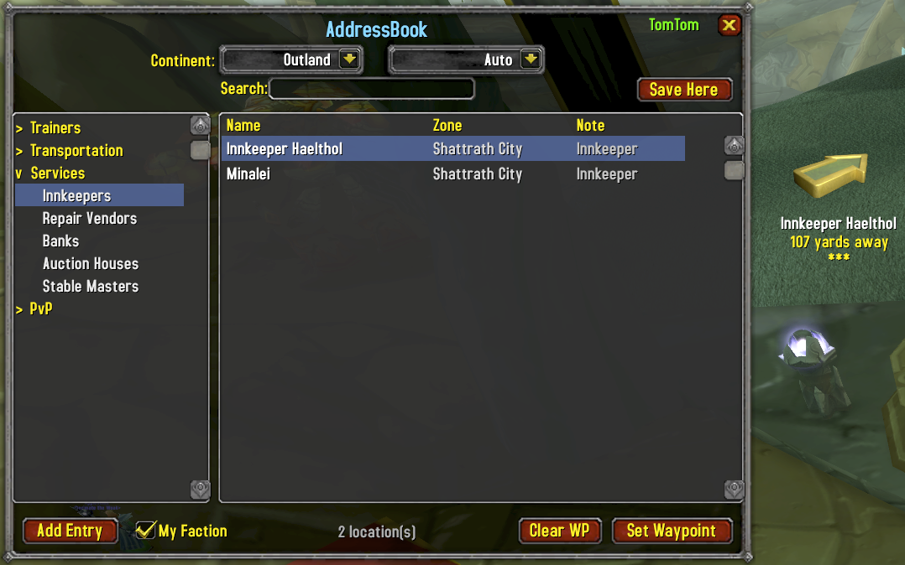

<p align="center">
  
</p>

<h1 align="center">AddressBook</h1>

<p align="center">
  A World of Warcraft TBC Anniversary addon that helps you find NPCs, creatures, and locations with one-click TomTom waypoint navigation.<br/>
  13,600+ pre-populated locations with 83,000+ spawn points. Continent/zone filtering, search, favorites, and custom entries.
</p>

<p align="center">
  <strong>Author:</strong> Breakbone - Dreamscythe&nbsp;&nbsp;|&nbsp;&nbsp;<strong>Interface:</strong> 20505 (TBC Anniversary)
</p>

---

## Browse & Navigate

Find any NPC by category, continent, and zone. Select an entry and set a TomTom waypoint with one click or double-click. The "Auto" filter detects your current zone automatically.



- 13,600+ entries: quest givers, trainers, vendors, flight masters, innkeepers, banks, instance entrances, 7,500+ creatures, 425 critters, and more
- Sortable columns — click Name, Zone, or Note headers to sort
- Continent and zone dropdowns with auto-detect
- Category tree: Quests, Instances, Trainers, Vendors, Transportation, Services, PvP, Creatures, Critters, Custom
- Double-click any entry to set a waypoint instantly
- Right-click for context menu (set waypoint, set all waypoints, favorite, edit, delete)

## Favorites

Mark any entry as a favorite from the right-click menu. Favorites appear in green and are collected in a dedicated Favorites category at the top of the tree for quick access. Favorites persist across sessions.

## Creatures & Critters

Browse 7,500+ creatures and 425 critters across 110 zones (outdoor and instances). Each creature stores all known spawn points. Right-click and "Set All Waypoints" to light up the map with every spawn location. Instance creatures point to the dungeon/raid entrance when you're in the open world.

- All spawn points stored per creature (83,000+ total)
- Set All Waypoints places a TomTom pin at every spawn
- Instance creatures auto-redirect to entrance from the open world
- Creature data loads on demand and unloads when window closes to save memory

## TomTom Integration

Click "Set Waypoint" or double-click any entry to create a TomTom waypoint with navigation arrow. The crazy arrow points you directly to your destination. Works seamlessly — if TomTom isn't installed, coordinates are printed to chat instead.

- One-click waypoint creation from any entry
- Automatic waypoint clearing when setting a new one
- Fallback coordinate display without TomTom
- Waypoints display "From: AddressBook" in TomTom tooltips

## Search

Search across all categories by NPC name, zone, or description. Results update as you type, regardless of which category is selected. Bidirectional matching handles plurals and partial names (e.g., "Voidshriekers" finds "Voidshrieker").

## Addon API

Other addons can call into AddressBook to look up NPCs and set waypoints:

```lua
-- Set waypoint to nearest spawn
AddressBook.API:WaypointTo("Voidshrieker", "Netherstorm")

-- Show all spawn points on the map
AddressBook.API:ShowSpawns("Voidshrieker", "Netherstorm")

-- Full lookup with options
local results, definitive = AddressBook.API:Lookup("Voidshrieker", {
    zone = "Netherstorm",
    action = "all",  -- "none", "nearest", or "all"
})
```

## Custom Locations

Save your own locations to a personal address book. Click "Add Entry" to open the entry dialog with fields for name, coordinates, zone, and notes. Use the "Current Location" button to auto-fill your position.

- Add entries manually or from your current position
- Edit name, coordinates, zone, and notes
- Custom entries persist across sessions
- Update existing entry coordinates with `/ab record`

## Filtering

Narrow results with three independent filters that work together:

- **Category** — Select NPC type from the left panel (trainers, innkeepers, etc.)
- **Continent** — Eastern Kingdoms, Kalimdor, or Outland
- **Zone** — Any zone within the selected continent
- **Auto mode** — Continent and zone auto-detect from your current position
- **Faction filter** — Toggle to show only NPCs friendly to your faction

## Usage

| Action | How |
|--------|-----|
| Open AddressBook | Left-click minimap button, or `/ab` |
| Add entry | Click "Add Entry" button |
| Search | `/ab search <query>` |
| Add from chat | `/ab add` |
| Update entry coords | `/ab record <name>` |
| Set waypoint | `/ab waypoint <name>` |

## Data Sources

Location data is extracted from the [Questie](https://github.com/Questie/Questie) addon's TBC NPC database (GPL licensed). Coordinates are verified against the game client's C_Map API at runtime, so mapIDs resolve correctly regardless of WoW client version.

## Dependencies

No hard addon dependencies. TomTom is optional but recommended. The following libraries are bundled:

- LibStub
- CallbackHandler-1.0
- LibDataBroker-1.1
- LibDBIcon-1.0

## Limitations

- Built for and tested on the **WoW TBC Anniversary** client only.
- All UI text and data is in **English only**.
- Pre-populated coordinates are sourced from Questie and may occasionally be imprecise. Use `/ab record <name>` to correct entries in-game.

## Installation

Copy the `AddressBook` folder into your WoW AddOns directory:

```
World of Warcraft/_anniversary_/Interface/AddOns/AddressBook/
```
